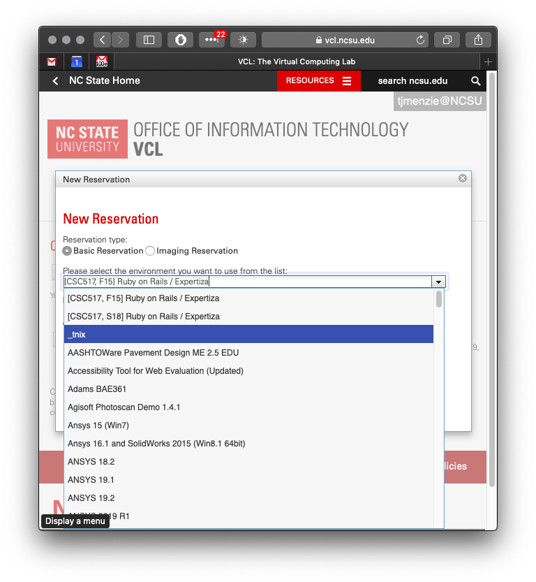
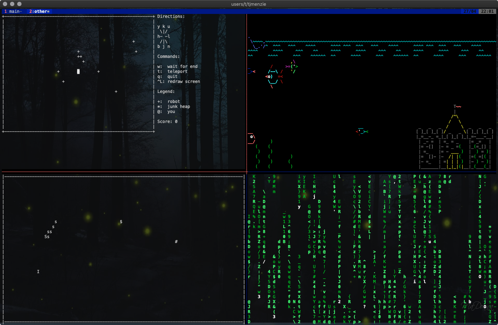

# _tnix :  useful tools for NCSU VCL 

`_tnix` is an NCSU VCL image preconfigured with many useful tools. 

To use the image, first select "_tnix" from the reservations menu:

<center><a href="reserve.png"></a></center>

Once you login, type..

```sh
. tnix
```

## Why TNIX?

Every time you log back into a VCL 
image to `$HOME`, its a fresh copy of that image.
This makes installations... interesting. So my _tnix_ image
adds lots of cool tools, 
then ensures that all their
config files are in your permanent file storage space (e.g.) `/afs/unity.ncsu.edu/users/t/tjmenzie/.config`.

## What this gives you?

### A Better Work Environment (with Tmux)

Tmux lets you have multiple resizable text panes inside multiple windows.
If the net connection goes down, `tmux` saves
the session and you can start up, just where you were, using `tmux attach`.

For an example of this environment in action, here are two windows. The first shows:

- top left: some `vim` text editing with a little file tree
- bottom right: the `Julia` interpreter running
- top right: the `htop` system monitor
- middle-right: a shell for bash commands
- bottom-right: the midnight commander file manager

<center><a href="work.png"></a></center>

The second window shows for text games in four panes:

<center><a href="play.png"></a></center>


<table>
<tr>
<td valign=top>
<h3><a id="user-content-a-better-shell" class="anchor" aria-hidden="true" href="#a-better-shell"><svg class="octicon octicon-link" viewBox="0 0 16 16" version="1.1" width="16" height="16" aria-hidden="true"><path fill-rule="evenodd" d="M4 9h1v1H4c-1.5 0-3-1.69-3-3.5S2.55 3 4 3h4c1.45 0 3 1.69 3 3.5 0 1.41-.91 2.72-2 3.25V8.59c.58-.45 1-1.27 1-2.09C10 5.22 8.98 4 8 4H4c-.98 0-2 1.22-2 2.5S3 9 4 9zm9-3h-1v1h1c1 0 2 1.22 2 2.5S13.98 12 13 12H9c-.98 0-2-1.22-2-2.5 0-.83.42-1.64 1-2.09V6.25c-1.09.53-2 1.84-2 3.25C6 11.31 7.55 13 9 13h4c1.45 0 3-1.69 3-3.5S14.5 6 13 6z"></path></svg></a>And a Better Shell</h3>

<p>Tools that know how to read their config files from persistent disk memory:
e.g. <code>tmux</code>,
<code>vim</code>


<p>Command line prompts that show:
current <code>git</code> branch;
just the top 3 directories;
hostname.

<p>Simpler <code>git</code> control
<ul>
<li>get = <code>git pull</code></li>
<li>put = <code>git commit -am saving; git push; git status</code></li>
</ul>
<p>Syntax highlighting added to the <code>less</code> pager.

</td>
<td valign=top>
<h3><a id="user-content-a-better-vim" class="anchor" aria-hidden="true" href="#a-better-vim"><svg class="octicon octicon-link" viewBox="0 0 16 16" version="1.1" width="16" height="16" aria-hidden="true"><path fill-rule="evenodd" d="M4 9h1v1H4c-1.5 0-3-1.69-3-3.5S2.55 3 4 3h4c1.45 0 3 1.69 3 3.5 0 1.41-.91 2.72-2 3.25V8.59c.58-.45 1-1.27 1-2.09C10 5.22 8.98 4 8 4H4c-.98 0-2 1.22-2 2.5S3 9 4 9zm9-3h-1v1h1c1 0 2 1.22 2 2.5S13.98 12 13 12H9c-.98 0-2-1.22-2-2.5 0-.83.42-1.64 1-2.09V6.25c-1.09.53-2 1.84-2 3.25C6 11.31 7.55 13 9 13h4c1.45 0 3-1.69 3-3.5S14.5 6 13 6z"></path></svg></a>And a Better VIM</h3>
<p><code>Vim8</code>, of course, with
config files written to persistent part of disk memory.
<p>My Vim includes
syntax highlighting,
incremental search (with highlighting),
a better status line,
better colors enabled,
pane separator colors muted.
<p>My Vim also includes
the Vundle package manager installed, which in turn lets me install:
<ul>
<li><code>nerdtree</code></li>
<li>various color schemes</li>
<li>and other cool stuff</li>
</ul>
</td>
<td valign=top>
<h3><a id="user-content-lottsa-pre--stuff-installed" class="anchor" aria-hidden="true" href="#lottsa-pre--stuff-installed"><svg class="octicon octicon-link" viewBox="0 0 16 16" version="1.1" width="16" height="16" aria-hidden="true"><path fill-rule="evenodd" d="M4 9h1v1H4c-1.5 0-3-1.69-3-3.5S2.55 3 4 3h4c1.45 0 3 1.69 3 3.5 0 1.41-.91 2.72-2 3.25V8.59c.58-.45 1-1.27 1-2.09C10 5.22 8.98 4 8 4H4c-.98 0-2 1.22-2 2.5S3 9 4 9zm9-3h-1v1h1c1 0 2 1.22 2 2.5S13.98 12 13 12H9c-.98 0-2-1.22-2-2.5 0-.83.42-1.64 1-2.09V6.25c-1.09.53-2 1.84-2 3.25C6 11.31 7.55 13 9 13h4c1.45 0 3-1.69 3-3.5S14.5 6 13 6z"></path></svg></a>Also, pre-installed...</h3>
<p>Documentation tools:
<code>aspell</code>, <code>pandoc</code>, <code>pycco</code>.

<p>Editing tools:
<code>vim8</code> with <code>Nerdtree</code> and other cool tools.
<p>File management tools:
<code>mc</code>, <code>tree</code>, <code>wget</code>.

<p>Fun:
<code>bsdgames</code>, <code>cmatrix</code>, <code>asciiquarium</code>.

<p>Languages:
<code>clisp</code>, <code>gawk</code>, <code>gnu-smalltalk</code>, <code>javascript</code>, <code>haskell</code>, <code>lua</code>, <code>luajit</code>, <code>python</code>, <code>python3</code>, <code>swi-prolog</code>.

<p>Plotting:
<code>gnuplot</code>.

<p>Programming utilities:
<code>pip</code>,
<code>ctag</code>.

<p>Session management tools:
<code>tmux</code>.

<p>System monitoring:
<code>htop</code>, <code>ncdu</code>.

</td>
</tr></table>

## How to Use

Run the install instructions, below. Only do that once

Then, each time you log in, in the log directory, run...

```sh
. tnix
```

Other options can be accessed via

```sh
tnix help
```

`tnix` offers some useful verbs:

- _tnix os_ :  update and upgrade all
- _tnix update_ : stuff to do a lot (e.g. daily)
- _tnix once_ :   stuff to do once
- _tnix insall_  : stuff not to do (unless you can save an image)
- _tnix all_ : do everthing (but don't use if you cannot save the image)
- _tnix vim8_ : install some vim8 tools
- _tnix commit_ :  a sysadmin trick (saves the config files to `github.com/timm/dot/`

### Test

1. Run the command `tmux`. Ignore any errors you see.
2. Press control-space. Then press shift-S. You should then see something like the above screenshots.
3. Try grabbing a pane boundary with the mouse.
   Check that you can resize something.
4. Leave tmux  by pressing `control-space`. Then
   press `d`. This should take you back to the shell.
5. Return to your old `tmux` session. Run `tmux attach`. Check you can see you resized pane.

