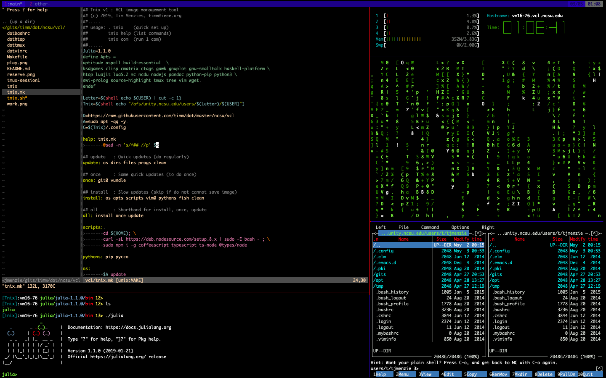

# Timm's NCSU VCL set up


## What this gives you

### Lottsa pre- stuff installed


- Documentation: 
     - apsell, pandoc, pycco
- Editting: 
     - vim8 with Nertree and other cool tools.
- File management: 
     - mc, tree, wget
- Fun: 
     - bsdgames, cmatric, asciiquarium
- Languages: 
     - clisp, gawk, gnu-smalltalk, javascript, haskell, lua, luajit, python, python3, swi-prolog
- Plotting:
     - gnuplot
- Programming utitlies: 
     - pip
     - ctag
- Session management:
     - tmux
- System monitoring: 
     - htop, ncdu, pfyd

### A Better Shell

- Command line prompts that show:
     - current git branch
     - just the top 3 directories 
     - hostname
- Tools that know how tor ead their config files from persistent disk memory
     - tmux
     - vim
- Simpler version control for git
     - get = `git pull`
     - put = `git commit -am saving; git push; git status`

### A Better Tmux

Tmux lets you have multiple resizable text panes inside multiple windows.
For example, where are two windows. The first shows:

- top left: some Vim text editting with a little file treel
- bottom right: the Julia interpreter running
- top right: the `htop` system monitor
- middle-right: a shell for bash commands
- bottom-right: the midnight commander file manager

<a href="work.png"></a>

The second window shows for text games in four panes:

<a href="play.png"></a>

### A Better VIM

Vim8, of course, with

- config files written to persistent part of disk memory
- syntax highlighting
- incremental search (with highlighting)
- a better status line
- better colors enabled
- pane seperator colors muted
- Vundle package manager installed, which in turn lets me install:
      - nerdtree
      - various color schemes
      - and other cool stuff
- etc

## Installation

In this install, all config files are written to EOS space
(since, in VCL, everything in the login directories are reset every login).

### Step1: Set up git

```sh
# replace UPPER case words with your details
# e.g. git config --global user.name "Tim Menzies"
# e.g. git config --global user.email "timm@ieee.org"

git config --global user.name "FIRST_NAME LAST_NAME"
git config --global user.email "MY_NAME@EXAMPLE.COM"
git config --global push.default simple
```

### Step2: Cd into your eos file space. 

```sh
# replace U/USERNAME with 1st letter of username, then username
# e.g. cd /afs/unity.ncsu.edu/users/t/tjmenzie

cd /afs/unity.ncsu.edu/users/U/USERNAME
```

### Step3: For the conf directory:

- First make that director
- Then download timmnix.sh
- Then run `timmnix.sh`

```sh
mkdir .config
cd .config
wget -O timmnix.sh https://raw.githubusercontent.com/timm/dot/master/ncsu/vcl/timmnix.sh
bash timmnix.sh
```

If you see something like the following errors, just ignore them:

- E: Unable to change to /afs/unity.ncsu.edu/users/t/tjmenzie/.config/ - chdir (13: Permission denied)
- DEPRECATION: Python 2.7 will reach the end of its life on January 1st, 2020.

### Step4: Then relaunch bash to get everything 

- Log out then login again
- Or do `. $HOME/.bashrc`


